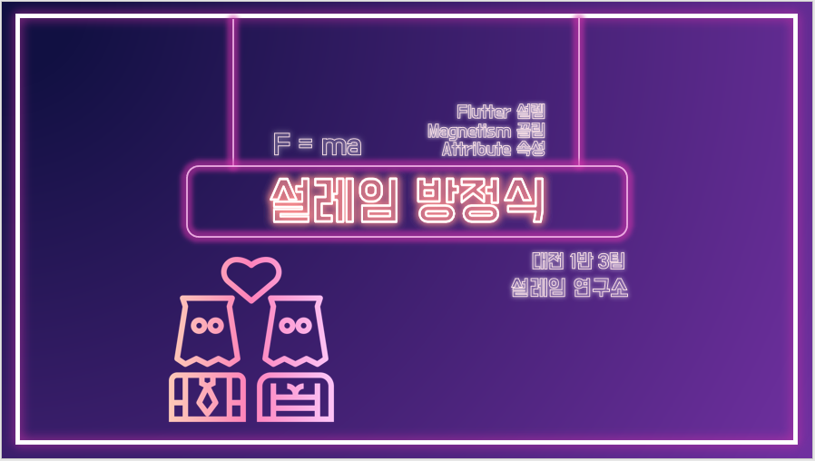
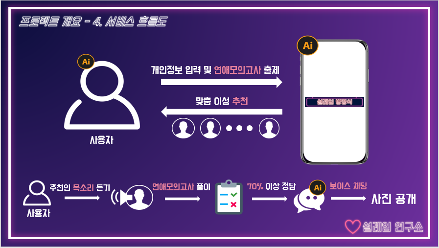
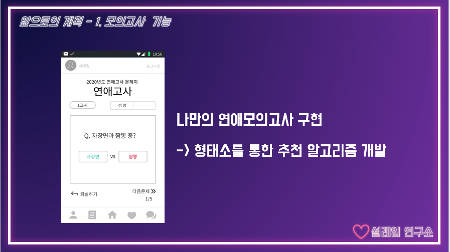
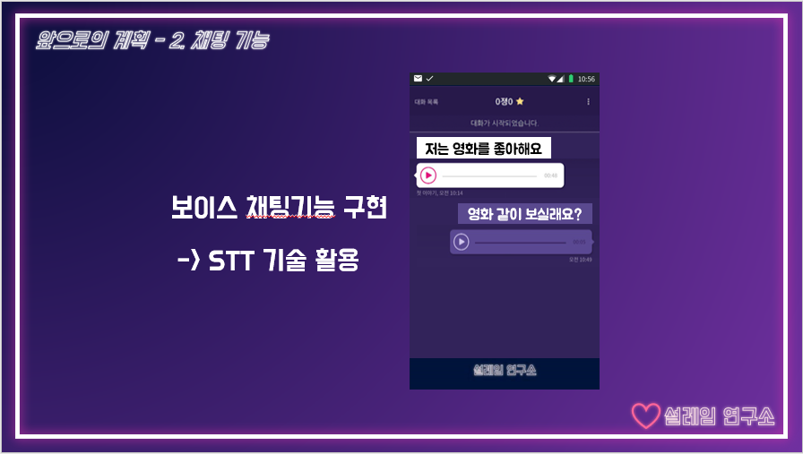
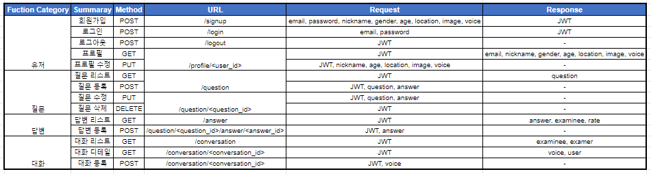
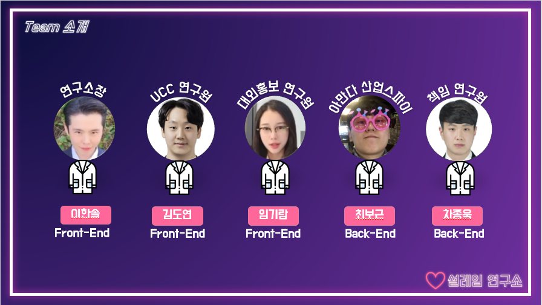
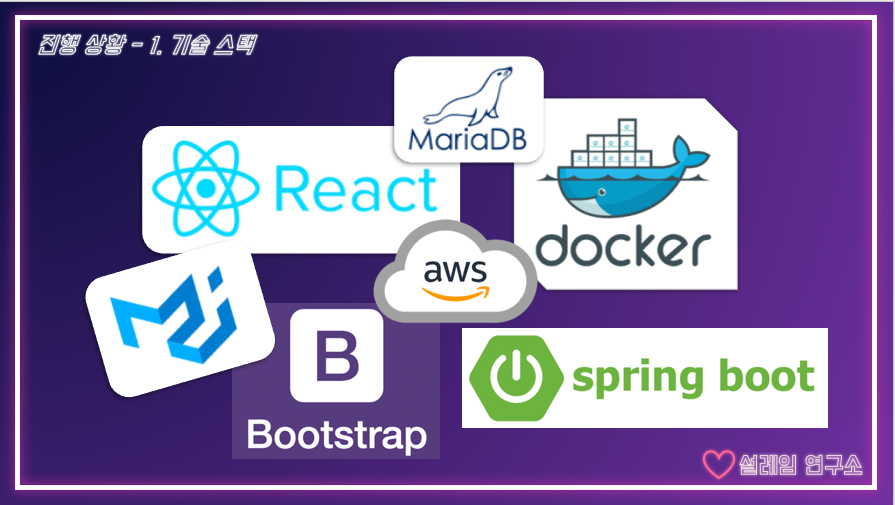

:computer: [DEMO][#]


## :earth_asia: OVERVIEW :earth_africa:

### 프로젝트 소개

> 만남의 시작이 "외모" 중심인 다른 소개팅 서비스와 달리 성향과 분위기가 첫 번째 판단요소가 되는 소개팅 서비스입니다.


### 와이어 프레임







### 핵심 AI 기술


- 한국어 형태소 분석기
- STT(Speech to Text)
- Face Detection


### ERD 설계

https://www.erdcloud.com/d/MfDhFZnTHQv7ArBjY


### API 설계

https://docs.google.com/spreadsheets/d/1xhZJ7gVJMMfN37XFH8KtwAoNITPtgNAwOYauqZrRujI/edit#gid=1748123396




## :boy: AUTHORS :woman:

###### 대전 1반 3팀, 설레임 연구소



- 이한솔 - 팀장, Frontend, QA
- 김도연 - Frontend, UCC, Presentation
- 임기람 - Frontend, PPT, Presentation
- 차종욱 - Backend, Database, QA
- 최보근 - Backend, Database, Deploy


## :sunny: TECH STACK :zap:



### Backend

- Spring Boot

### Frontend

- React
- Bootstrap
- Material-UI

### Database

- MariaDB

### 형상관리

- GitLab


## :four_leaf_clover: STEPS TO RUN :hibiscus: 

#### frontend/

###### npm

```bash
$ npm i
$ npm start
```

###### yarn

```bash
$ yarn install
$ yarn start
```


## :page_facing_up: LICENSE :memo:

Copyright © 2020 I 설레임 연구소.
This project is MIT licensed.