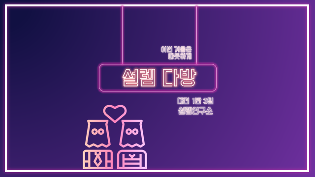

:computer: [DEMO][#]


## :earth_asia: OVERVIEW 

### :hibiscus: 프로젝트 소개

>   최근 소개팅 및 데이팅 어플리케이션의 인기가 높아지고 있습니다. 이에 따라 저희 팀은 SSAFY 기간동안 배우고, 익힌 기술을 활용해 4차 산업 혁명 기술에 기반한 소개팅 서비스를 제작했습니다. 많은 소개팅 어플리케이션들이 외모, 학벌, 직업 등 개인의 피상적인 정보를 활용해 매칭이 이루어지고 있습니다. 저희 서비스는 취향, 성향 그리고 분위기 등의 정성적인 정보를 활용하여 만남의 시작을 제공합니다. 이에따라 만남의 진정성, 사용자가 중심되는 추천, 매칭 시스템으로 서비스 만족도를 높이려 집중했습니다.


### :woman: 서비스 흐름

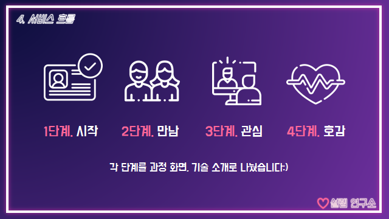


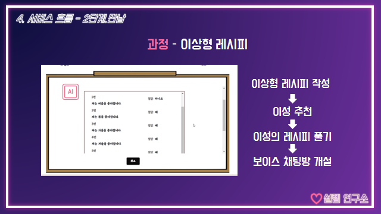

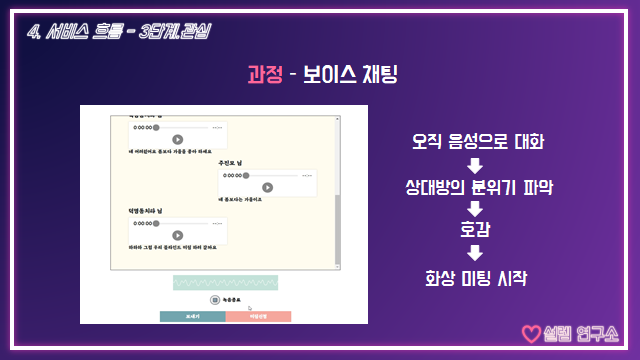

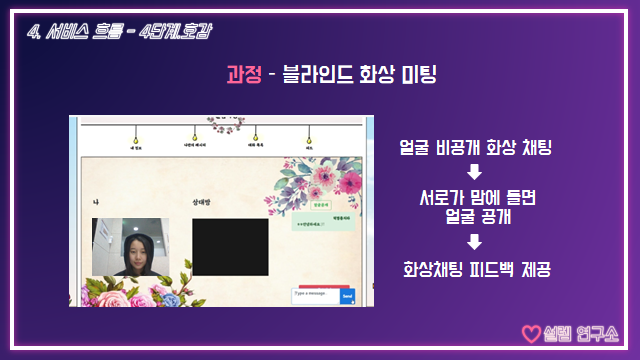


### :earth_africa: 핵심 AI 기술

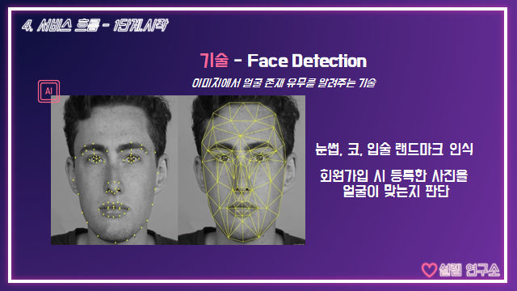

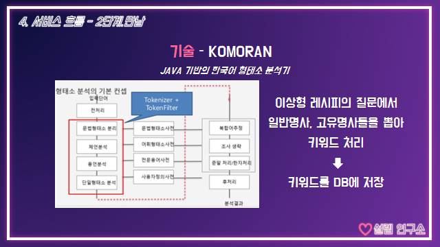

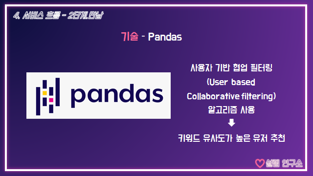


### :zap: ERD 설계

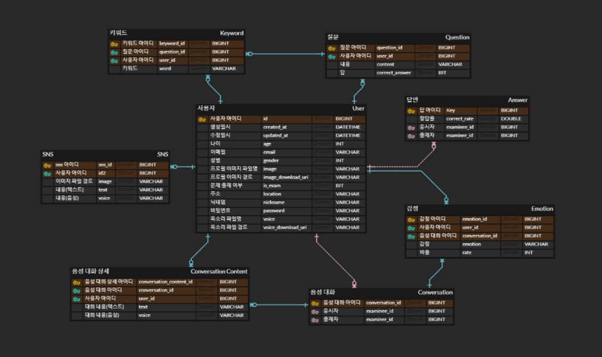


### :memo: API 설계

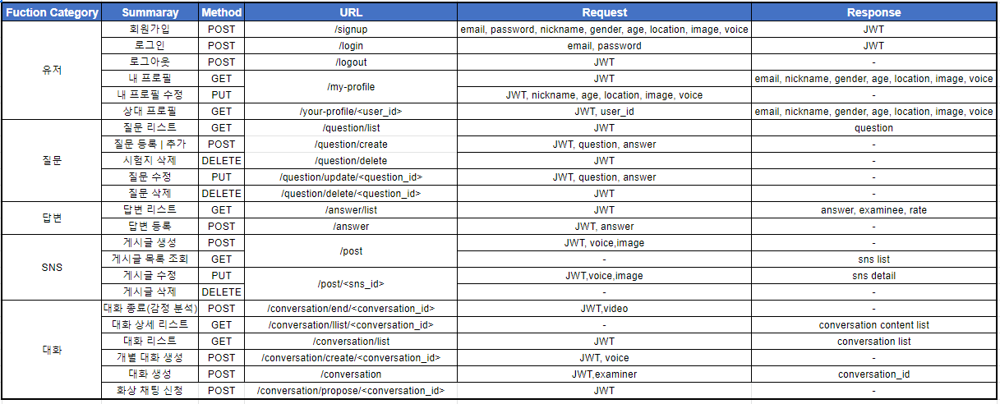


## :boy: AUTHORS 

###### 대전 1반 3팀, 설레임 연구소

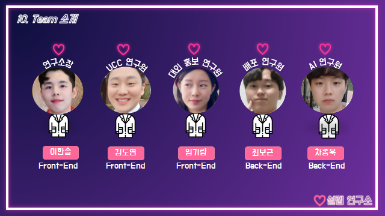

- 이한솔 - 팀장, Frontend, QA
- 김도연 - Frontend, UCC, Presentation
- 임기람 - Frontend, PPT, Presentation
- 차종욱 - Backend, Database, QA
- 최보근 - Backend, Database, Deploy


## :sunny: TECH STACK 

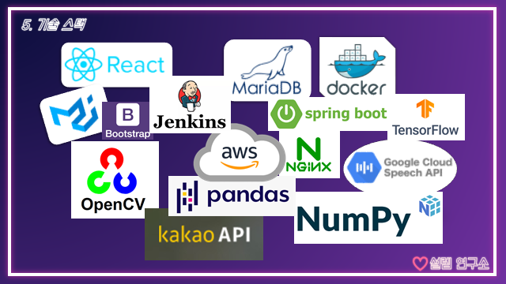

### Backend

- Spring Boot

#### 중개서버

- Node express

### Frontend

- React
- Bootstrap
- Material-UI

### Database

- MariaDB

### 형상관리

- GitLab


## :four_leaf_clover: STEPS TO RUN 

#### frontend/

###### npm

```bash
$ npm i
$ npm start
```

###### yarn

```bash
$ yarn install
$ yarn start
```


#### server.js

###### npm

```bash
$ npm run server
```

###### yarn

```bash
$ yarn server
```


## :page_facing_up: LICENSE 

Copyright © 2020 I 설레임 연구소.
This project is MIT licensed.

[#]: 